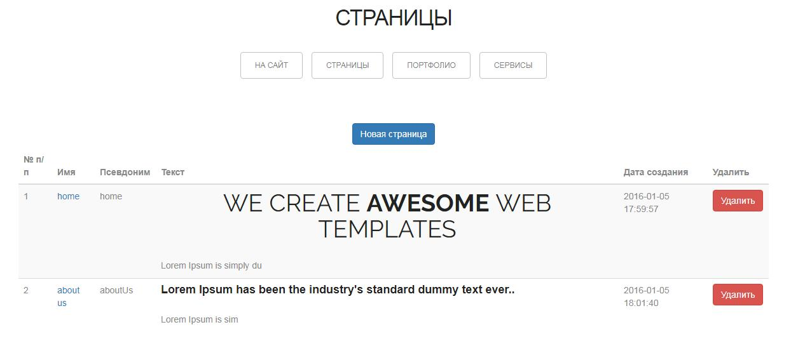
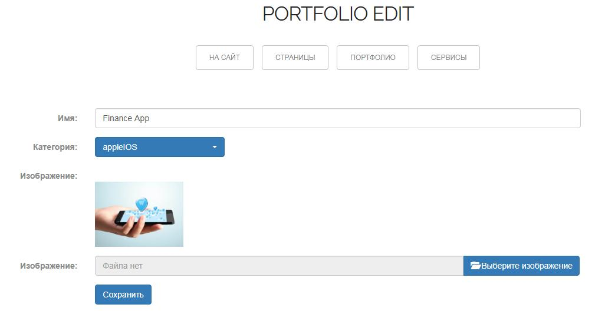
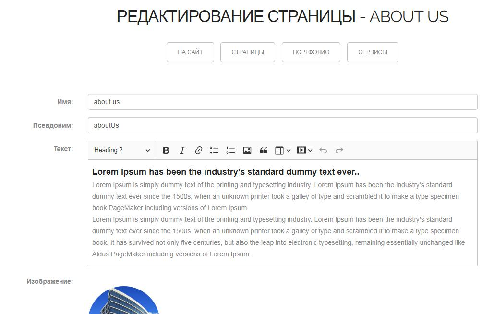

# LAND01 - Simple website on Laravel 5.8

Simple site. It includes the main sections such as: HOME, ABOUT US, SERVICE, PORTFOLIO, TEAM, CONTACT.

Main functionalities: 
- add/edit/remove material in sections "SERVICE", "PORTFOLIO"; 
- separate section to administrate site.

Main routes:

* /login - Login/Registered in system
* /home  -  Logout

* /admin - Administrate part of site

## Requirements
- PHP 7.2
- MYSQL 

HTML Template by WebThemez.com.